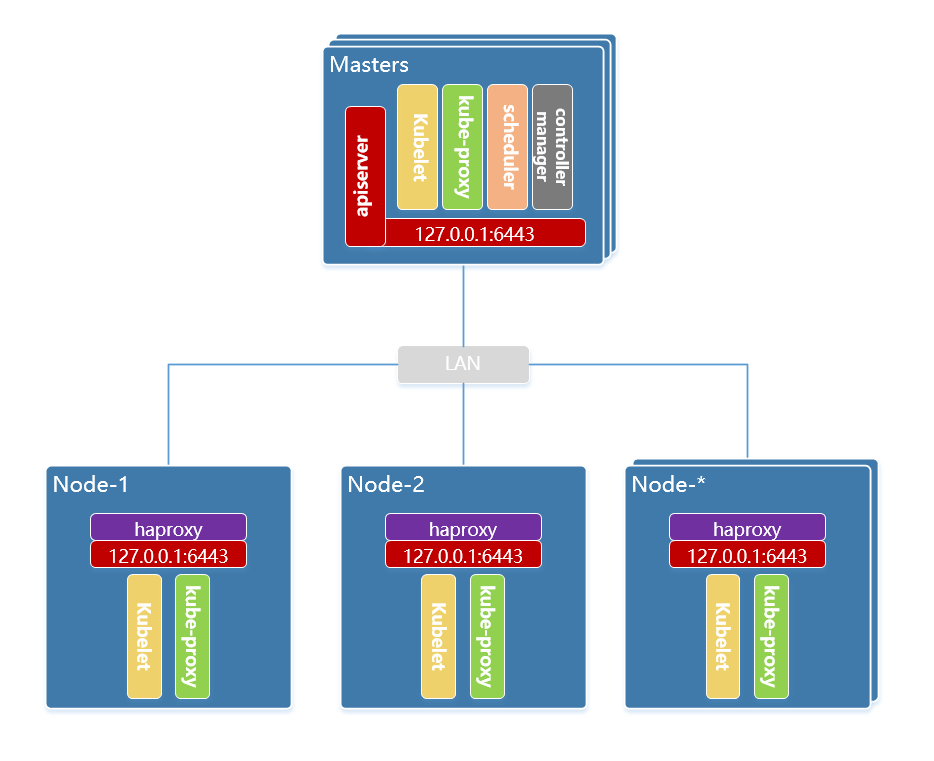

# kainstall  = kubeadm install
基于 kubeadm 一键部署 kubernetes 集群


## Why

**为什么要搞这个？ansible playbook 不好么？**

**因为懒**，ansible playbook编排是非常给力的，不过需要安装python和ansible。**因为懒**，我想要个更简单的方式来快速部署一个分布式的 kubernetes ha集群， 使用 shell 脚本可以不借助外力直接在服务器上运行，省时省力。


## Require

OS: `centos 7.x`

CPU: `2C`

MEM: `2G`

> 需要连通外网，用于下载 kube 组件和 docker 镜像。


## Architecture




> 如需按照步骤安装集群，可参考 https://lework.github.io/2019/10/01/kubeadm-install/


## Usage

### 下载脚本

```bash
wget https://cdn.jsdelivr.net/gh/lework/kainstall/kainstall.sh
```

### 帮助信息

```bash
# bash kainstall.sh 

Install kubernetes cluster using kubeadm.

Usage:
  kainstall.sh [command]

Available Commands:
  init            init Kubernetes cluster.
  reset           reset Kubernetes cluster.
  add             add nodes to the cluster.
  del             remove node from the cluster.

Flag:
  -m,--master     master node, default: ''
  -w,--worker     work node, default: ''
  -u,--user       ssh user, default: root
  -p,--password   ssh password,default: 123456
  -P,--port       ssh port, default: 22
  -v,--version    kube version, default: latest
  -n,--network    cluster network, choose: [flannel,calico], default: flannel
  -i,--ingress    ingress controller, choose: [nginx,traefik], default: nginx

Example:
  [cluster node]
  kainstall.sh init \
  --master 192.168.77.130,192.168.77.131,192.168.77.132 \
  --worker 192.168.77.133,192.168.77.134,192.168.77.135 \
  --user root \
  --password 123456 \
  --version 1.19.2 \
  --network flannel \
  --ingress nginx

  [cluster node]
  kainstall.sh reset \
  --master 192.168.77.130,192.168.77.131,192.168.77.132 \
  --worker 192.168.77.133,192.168.77.134,192.168.77.135 \
  --user root \
  --password 123456 \
  --version 1.19.2

  [add node]
  kainstall.sh add \
  --master 192.168.77.140,192.168.77.141 \
  --worker 192.168.77.143,192.168.77.144 \
  --user root \
  --password 123456 \
  --version 1.19.2

  [del node]
  kainstall.sh del \
  --master 192.168.77.140,192.168.77.141 \
  --worker 192.168.77.143,192.168.77.144 \
  --user root \
  --password 123456 \
  --version 1.19.2


  See detailed log >>> /tmp/kainstall.RBfHgbjYUG/kainstall.log 
```

> 脚本执行的详细日志都会保存在临时目录中 `/tmp/kainstall.RBfHgbjYUG/kainstall.log `

### 初始化集群

```bash
bash kainstall.sh init \
  --master 192.168.77.130,192.168.77.131,192.168.77.132 \
  --worker 192.168.77.133,192.168.77.134 \
  --user root \
  --password 123456 \
  --port 22 \
  --version 1.19.2
```

### 增加节点

> 操作需在 k8s master 节点上操作，ssh连接信息非默认时请指定

```bash
# 增加单个master节点
bash kainstall.sh add --master 192.168.77.135

# 增加单个worker节点
bash kainstall.sh add --worker 192.168.77.134

# 同时增加
bash kainstall.sh add --master 192.168.77.135,192.168.77.136 --worker 192.168.77.137,192.168.77.138
```

### 添加ingress

> 操作需在 k8s master 节点上操作，ssh连接信息非默认时请指定

```bash
# 添加 nginx ingress
bash kainstall.sh add --ingress nginx
```


### 删除节点

> 操作需在 k8s master 节点上操作，ssh连接信息非默认时请指定
```bash
# 删除单个master节点
bash kainstall.sh add --master 192.168.77.135

# 删除单个worker节点
bash kainstall.sh add --worker 192.168.77.134

# 同时删除
bash kainstall.sh add --master 192.168.77.135,192.168.77.136 --worker 192.168.77.137,192.168.77.138
```

### 重置集群

```bash
bash kainstall.sh reset \
  --master 192.168.77.130,192.168.77.131,192.168.77.132 \
  --worker 192.168.77.133,192.168.77.134 \
  --user root \
  --password 123456 \
  --port 22 \
```

